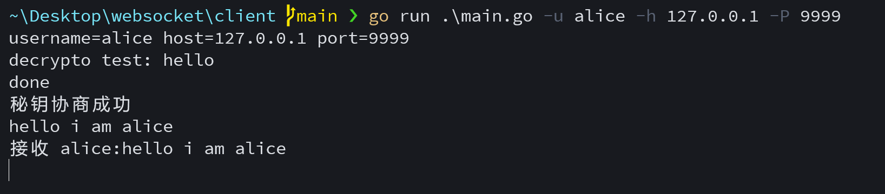
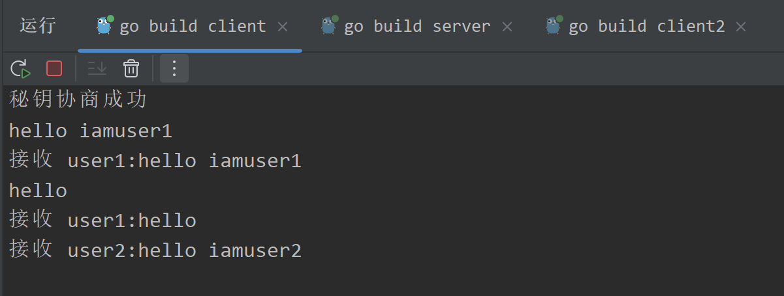
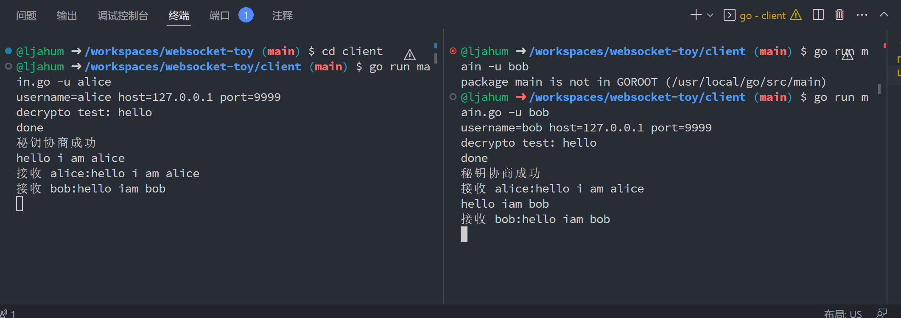

# 一个基础的websocket命令行聊天室模板
## updata 2023-3-8

增加RSA证书验证

增加命令行友好模式



## updata 2023-3-1

加入dh密钥协商和aes加密传输

bug小多。。。



## example

C/S用软件包分开

### client
```shell

cd client
go mod init client
# 清理无效依赖，增加缺失依赖
go mod tidy
```
### server
```shell

cd server
go mod init server
# 清理无效依赖，增加缺失依赖
go mod tidy
```


